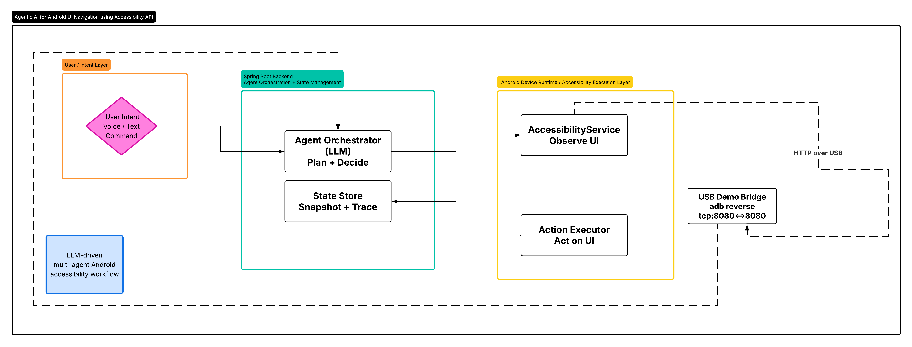
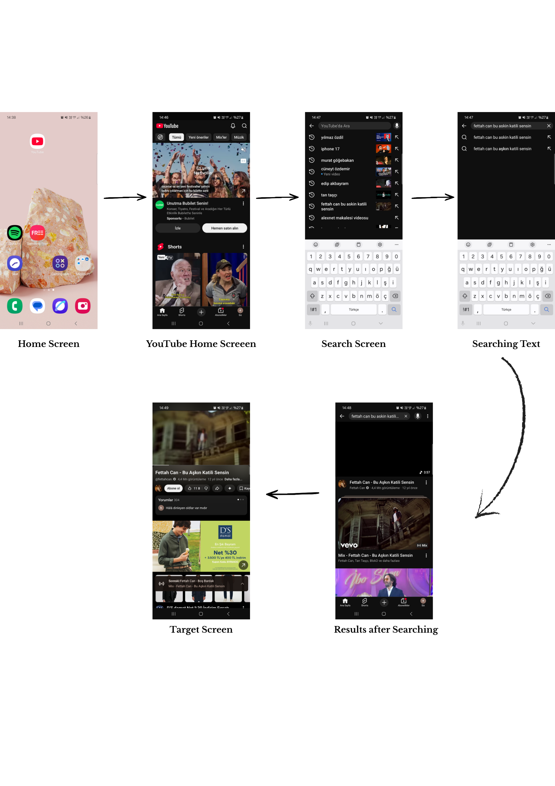

# Agentic AI for Android UI Navigation using Accessibility API

## Overview

This project presents an **agentic AI-based Android accessibility assistant** that enables mobile UI navigation through natural language instructions.

The system observes the current Android screen using the **Android Accessibility API**, interprets the user's intent, plans the required interaction steps, maps each step into executable Android actions, and executes them on a real Android device through an AccessibilityService.

The main idea is to move from manual screen-reader-based navigation toward an **intent-level interaction model**, where the user can express a goal such as:

> "Search for an AlexNet paper explanation video on YouTube and open the first result."

The system then coordinates multiple specialized agents to understand the goal, interpret the screen, plan the task, generate action commands, and execute them step by step.

---

## Motivation

Mobile applications are increasingly complex, dynamic, and visually dense. Even though Android screen readers provide access to UI elements, users may still need to manually reason about:

- where they are on the screen,
- which UI element is relevant,
- what action is possible,
- which sequence of actions is required,
- whether the screen has changed after an action.

This project explores how **LLM-assisted multi-agent reasoning** can support Android accessibility by combining:

- semantic screen interpretation,
- natural language intent understanding,
- task planning,
- action mapping,
- execution monitoring,
- and future recovery mechanisms such as retry, backtracking, and replanning.

---

## System Architecture



The system consists of three main layers:

### 1. User / Intent Layer

The user provides a natural language command through a frontend demo interface or API request.

Example:

```text
YouTube'da AlexNet paper explanation videosu ara ve ilk sonucu aç.
```

The request is sent to the Spring Boot backend, where the agent pipeline begins.

---

### 2. Spring Boot Backend / Agentic Reasoning Layer

The backend is responsible for agent orchestration, runtime state management, command queueing, and execution monitoring.

It coordinates the following specialized agents:

#### Screen Interpreter Agent

Converts the raw Android Accessibility node tree into a semantic screen representation.

Input:

* raw UI tree,
* node labels,
* content descriptions,
* bounds,
* supported accessibility actions,
* current screen context.

Output:

* `SemanticScreenState`,
* semantic UI elements,
* actionable node references,
* screen summary.

Example semantic interpretation:

```json
{
  "semanticId": "youtube_app_icon",
  "role": "BUTTON",
  "label": "YouTube",
  "actionNodeRef": "node_root_0_0_0_6",
  "supportedActions": ["CLICK", "LONG_CLICK", "FOCUS"]
}
```

---

#### Intent Clarifier Agent

Understands the user's natural language request and produces a structured resolved intent.

Responsibilities:

* detect user intent,
* identify target application,
* extract entities such as query text,
* ask clarification questions if the request is ambiguous,
* produce `ResolvedIntent` when the goal is clear.

Example output:

```json
{
  "intentType": "OPEN_FIRST_RESULT",
  "targetApplication": {
    "name": "YouTube",
    "packageName": "com.google.android.youtube"
  },
  "entities": {
    "query": "AlexNet paper explanation video"
  }
}
```

---

#### Task Planner Agent

Creates a high-level ordered task plan based on the resolved intent.

Example plan:

```text
1. Open YouTube
2. Find search input
3. Enter search query
4. Submit search
5. Open first result
6. Verify video playback
```

The Task Planner does not select Android node IDs directly. It only defines the logical steps required to complete the user's goal.

---

#### Action Mapper Agent

Maps the current task step and the current semantic screen state into a concrete Android action command.

Example:

```json
{
  "actionType": "CLICK",
  "targetSemanticId": "youtube_app_icon",
  "targetNodeId": "node_root_0_0_0_6",
  "sourceStepKind": "OPEN_APP"
}
```

The Action Mapper answers the question:

> "Given this current screen and this current plan step, which Android action should be executed?"

---

#### Safety Validator Agent

Handles sensitive or risky actions.

It is designed to support cases such as:

* sending messages,
* submitting forms,
* deleting content,
* payment-related actions,
* credential-related actions,
* actions requiring user consent.

For low-risk demo scenarios such as YouTube navigation, execution can usually proceed without additional confirmation.

---

#### Execution Monitor / Orchestrator

Controls the runtime execution loop.

Responsibilities:

* receive execution results from Android,
* verify whether an action succeeded,
* request fresh screen interpretation,
* mark completed steps,
* select the next pending step,
* trigger the Action Mapper again,
* support future retry, backtracking, and replanning mechanisms.

The long-term goal is to treat mobile UI navigation as a dynamic state-space search problem:

```text
Semantic screen state = state
Accessibility action = transition
User goal = target state
```

---

### 3. Android Device Runtime / Accessibility Execution Layer

The Android side runs an AccessibilityService in the background.

It performs two major responsibilities:

#### Observing the UI

The Android AccessibilityService reads the current screen using:

```java
getRootInActiveWindow()
```

It extracts the active `AccessibilityNodeInfo` tree and sends a raw screen snapshot to the backend.

The snapshot includes information such as:

* class name,
* package name,
* visible text,
* content description,
* bounds,
* clickable/editable/scrollable flags,
* supported actions,
* child nodes.

---

#### Executing Actions

The Android Action Executor receives `ActionCommand` objects from the backend and converts them into real Android Accessibility actions.

Examples:

```text
CLICK      -> node.performAction(ACTION_CLICK)
SET_TEXT   -> node.performAction(ACTION_SET_TEXT, args)
BACK       -> performGlobalAction(GLOBAL_ACTION_BACK)
SCROLL     -> node.performAction(ACTION_SCROLL_FORWARD)
```

After each action, Android reports an `ExecutionResult` back to the backend and sends an updated screen snapshot.

---

## Android–Backend Communication

The Accessibility API itself does not perform HTTP communication.

Instead, the Android application includes a separate HTTP client that communicates with the Spring Boot backend.

The Android side:

```text
POST /api/accessibility/snapshot
GET  /api/action/commands/next
POST /api/action/commands/result
```

During local demo execution:

* Spring Boot runs on the laptop at `localhost:8080`.
* The Android phone is connected via USB.
* `adb reverse` is used to forward Android requests to the laptop backend.

Command:

```bash
adb reverse tcp:8080 tcp:8080
```

This means that when the Android device sends a request to:

```text
http://127.0.0.1:8080
```

the request is forwarded to the laptop's Spring Boot backend:

```text
localhost:8080
```

---

## Demo Scenario

The current demo focuses on YouTube navigation.

Example user prompt:

```text
YouTube'da AlexNet paper explanation videosu ara ve ilk sonucu aç.
```

Expected execution flow:

```text
Home Screen
-> Open YouTube
-> Tap Search
-> Enter Query
-> Submit Search
-> Open First Result
-> Observe Target Screen
```



The system demonstrates:

* screen snapshot transfer,
* semantic UI interpretation,
* intent resolution,
* task planning,
* action mapping,
* Android command execution,
* result reporting,
* observe-act-observe loop.

---

## Frontend Demo Dashboard

A simple web interface is used for live demonstration.

The frontend is designed to be visitor-friendly and hides raw agent logs.

It displays:

* user input,
* assistant response,
* clarification or confirmation message,
* current execution phase,
* step progress,
* Android snapshot status,
* pending command count,
* last action command,
* latest execution result.

The goal of the UI is to show **what the system is doing** without exposing unnecessary implementation details.

---

## Key Contributions

* Modular multi-agent architecture for Android accessibility automation.
* Structured JSON contracts between specialized agents.
* Spring Boot backend connecting LLM reasoning with real Android UI execution.
* Command queue mechanism for sending executable actions to a connected Android device.
* Android AccessibilityService integration for both screen observation and UI action execution.
* State-aware foundation for future retry, backtracking, and replanning.

---

## Current Prototype Status

Implemented:

* Android AccessibilityService-based screen capture,
* raw accessibility tree transfer to backend,
* Spring Boot agent orchestration,
* Screen Interpreter agent,
* Intent Clarifier agent,
* Task Planner agent,
* Action Mapper agent,
* command queue,
* Android command polling,
* real Android UI action execution,
* execution result reporting,
* demo frontend dashboard.

Partially implemented / future direction:

* stronger ExpectedOutcome verification,
* deterministic fast-path action mapping,
* alternative command retry,
* backtracking,
* replanning,
* media and gesture support.

---

## Evaluation Focus

The system can be evaluated through:

* intent resolution accuracy,
* screen interpretation quality,
* task planning correctness,
* action mapping accuracy,
* execution success rate,
* latency per step,
* robustness against dynamic UI changes,
* recovery behavior after failed actions.

---

## Limitations

The current prototype is designed as a research and graduation project demo rather than a production-ready accessibility assistant.

Current limitations include:

* dynamic Android UI layouts may change node references,
* LLM-based reasoning introduces latency,
* some action types require further Android-side implementation,
* recovery mechanisms such as retry, backtracking, and replanning are still future work,
* the demo currently focuses on controlled scenarios such as YouTube navigation.

---

## Future Work

Planned improvements include:

* deterministic fast-path action mapping for common UI patterns,
* stronger post-action outcome verification,
* alternative command selection,
* backtracking over explored UI states,
* replanning when the system reaches a dead end,
* gesture-based interactions,
* better media control support,
* broader app coverage,
* more accessible user-facing interaction design.

---

## Summary

This project demonstrates an LLM-driven multi-agent workflow for Android accessibility navigation.

The Spring Boot backend performs reasoning and orchestration, while the Android AccessibilityService observes the UI, executes commands, and sends feedback.

The system follows an observe-reason-act-observe loop:

```text
User Intent
-> Screen Snapshot
-> Agent Reasoning
-> Action Command
-> Android Execution
-> Execution Result
-> Updated Snapshot
-> Continue
```

The long-term direction is a state-aware Android accessibility assistant that can understand user goals, navigate mobile interfaces, recover from failures, and support users through intent-level interaction.
